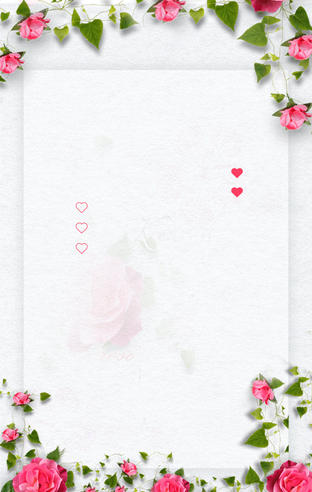
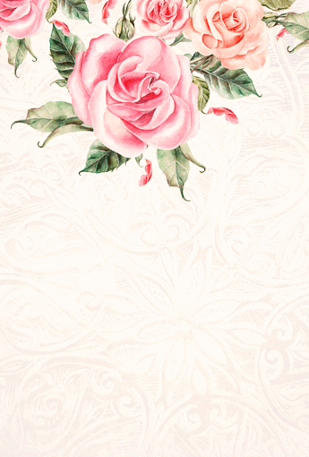

# 学微信小程序用的临时仓库

[PJ568 的博客](https://blog.pj568.sbs)

## 音频

`./assets/音乐/1.mp3`
`https://pj568.sbs/wxxcx-learn/assets/音乐/1.mp3`

`./assets/音乐/2.mp3`
`https://pj568.sbs/wxxcx-learn/assets/音乐/2.mp3`

`./assets/音乐/3.mp3`
`https://pj568.sbs/wxxcx-learn/assets/音乐/3.mp3`

`./assets/音乐/4.mp3`
`https://pj568.sbs/wxxcx-learn/assets/音乐/4.mp3`

`./assets/音乐/钢铁洪流进行曲 - 纯音乐.mp3`
`https://pj568.sbs/wxxcx-learn/assets/音乐/钢铁洪流进行曲 - 纯音乐.mp3`

`./assets/音乐/flourish.mid`
`https://pj568.sbs/wxxcx-learn/assets/音乐/flourish.mid`

`./assets/音乐/Focus0_48000Hz.raw`
`https://pj568.sbs/wxxcx-learn/assets/音乐/Focus0_48000Hz.raw`

`./assets/音乐/Focus1_48000Hz.raw`
`https://pj568.sbs/wxxcx-learn/assets/音乐/Focus1_48000Hz.raw`

`./assets/音乐/Focus2_48000Hz.raw`
`https://pj568.sbs/wxxcx-learn/assets/音乐/Focus2_48000Hz.raw`

`./assets/音乐/Focus3_48000Hz.raw`
`https://pj568.sbs/wxxcx-learn/assets/音乐/Focus3_48000Hz.raw`

`./assets/音乐/Focus4_48000Hz.raw`
`https://pj568.sbs/wxxcx-learn/assets/音乐/Focus4_48000Hz.raw`

`./assets/音乐/GoBack_48000Hz.raw`
`https://pj568.sbs/wxxcx-learn/assets/音乐/GoBack_48000Hz.raw`

`./assets/音乐/Hide_48000Hz.raw`
`https://pj568.sbs/wxxcx-learn/assets/音乐/Hide_48000Hz.raw`

`./assets/音乐/Invoke_48000Hz.raw`
`https://pj568.sbs/wxxcx-learn/assets/音乐/Invoke_48000Hz.raw`

`./assets/音乐/MoveNext_48000Hz.raw`
`https://pj568.sbs/wxxcx-learn/assets/音乐/MoveNext_48000Hz.raw`

`./assets/音乐/MovePrevious_48000Hz.raw`
`https://pj568.sbs/wxxcx-learn/assets/音乐/MovePrevious_48000Hz.raw`

`./assets/音乐/notify.wav`
`https://pj568.sbs/wxxcx-learn/assets/音乐/notify.wav`

`./assets/音乐/onestop.mid`
`https://pj568.sbs/wxxcx-learn/assets/音乐/onestop.mid`

`./assets/音乐/oscillofun.flac`
`https://pj568.sbs/wxxcx-learn/assets/音乐/oscillofun.flac`

`./assets/音乐/recycle.wav`
`https://pj568.sbs/wxxcx-learn/assets/音乐/recycle.wav`

`./assets/音乐/Ring01.wav`
`https://pj568.sbs/wxxcx-learn/assets/音乐/Ring01.wav`

`./assets/音乐/Ring02.wav`
`https://pj568.sbs/wxxcx-learn/assets/音乐/Ring02.wav`

`./assets/音乐/Ring03.wav`
`https://pj568.sbs/wxxcx-learn/assets/音乐/Ring03.wav`

`./assets/音乐/Ring04.wav`
`https://pj568.sbs/wxxcx-learn/assets/音乐/Ring04.wav`

`./assets/音乐/Ring05.wav`
`https://pj568.sbs/wxxcx-learn/assets/音乐/Ring05.wav`

`./assets/音乐/Ring06.wav`
`https://pj568.sbs/wxxcx-learn/assets/音乐/Ring06.wav`

`./assets/音乐/Ring07.wav`
`https://pj568.sbs/wxxcx-learn/assets/音乐/Ring07.wav`

`./assets/音乐/Ring08.wav`
`https://pj568.sbs/wxxcx-learn/assets/音乐/Ring08.wav`

`./assets/音乐/Ring09.wav`
`https://pj568.sbs/wxxcx-learn/assets/音乐/Ring09.wav`

`./assets/音乐/Ring10.wav`
`https://pj568.sbs/wxxcx-learn/assets/音乐/Ring10.wav`

`./assets/音乐/ringout.wav`
`https://pj568.sbs/wxxcx-learn/assets/音乐/ringout.wav`

`./assets/音乐/Show_48000Hz.raw`
`https://pj568.sbs/wxxcx-learn/assets/音乐/Show_48000Hz.raw`

`./assets/音乐/Speech Disambiguation.wav`
`https://pj568.sbs/wxxcx-learn/assets/音乐/Speech Disambiguation.wav`

`./assets/音乐/Speech Misrecognition.wav`
`https://pj568.sbs/wxxcx-learn/assets/音乐/Speech Misrecognition.wav`

`./assets/音乐/Speech Off.wav`
`https://pj568.sbs/wxxcx-learn/assets/音乐/Speech Off.wav`

`./assets/音乐/Speech On.wav`
`https://pj568.sbs/wxxcx-learn/assets/音乐/Speech On.wav`

`./assets/音乐/Speech Sleep.wav`
`https://pj568.sbs/wxxcx-learn/assets/音乐/Speech Sleep.wav`

`./assets/音乐/tada.wav`
`https://pj568.sbs/wxxcx-learn/assets/音乐/tada.wav`

`./assets/音乐/town.mid`
`https://pj568.sbs/wxxcx-learn/assets/音乐/town.mid`

`./assets/音乐/Windows Background.wav`
`https://pj568.sbs/wxxcx-learn/assets/音乐/Windows Background.wav`

`./assets/音乐/Windows Balloon.wav`
`https://pj568.sbs/wxxcx-learn/assets/音乐/Windows Balloon.wav`

`./assets/音乐/Windows Battery Critical.wav`
`https://pj568.sbs/wxxcx-learn/assets/音乐/Windows Battery Critical.wav`

`./assets/音乐/Windows Battery Low.wav`
`https://pj568.sbs/wxxcx-learn/assets/音乐/Windows Battery Low.wav`

`./assets/音乐/Windows Critical Stop.wav`
`https://pj568.sbs/wxxcx-learn/assets/音乐/Windows Critical Stop.wav`

`./assets/音乐/Windows Default.wav`
`https://pj568.sbs/wxxcx-learn/assets/音乐/Windows Default.wav`

`./assets/音乐/Windows Ding.wav`
`https://pj568.sbs/wxxcx-learn/assets/音乐/Windows Ding.wav`

`./assets/音乐/Windows Error.wav`
`https://pj568.sbs/wxxcx-learn/assets/音乐/Windows Error.wav`

`./assets/音乐/Windows Exclamation.wav`
`https://pj568.sbs/wxxcx-learn/assets/音乐/Windows Exclamation.wav`

`./assets/音乐/Windows Feed Discovered.wav`
`https://pj568.sbs/wxxcx-learn/assets/音乐/Windows Feed Discovered.wav`

`./assets/音乐/Windows Foreground.wav`
`https://pj568.sbs/wxxcx-learn/assets/音乐/Windows Foreground.wav`

`./assets/音乐/Windows Hardware Fail.wav`
`https://pj568.sbs/wxxcx-learn/assets/音乐/Windows Hardware Fail.wav`

`./assets/音乐/Windows Hardware Insert.wav`
`https://pj568.sbs/wxxcx-learn/assets/音乐/Windows Hardware Insert.wav`

`./assets/音乐/Windows Hardware Remove.wav`
`https://pj568.sbs/wxxcx-learn/assets/音乐/Windows Hardware Remove.wav`

`./assets/音乐/Windows Information Bar.wav`
`https://pj568.sbs/wxxcx-learn/assets/音乐/Windows Information Bar.wav`

`./assets/音乐/Windows Logoff Sound.wav`
`https://pj568.sbs/wxxcx-learn/assets/音乐/Windows Logoff Sound.wav`

`./assets/音乐/Windows Logon.wav`
`https://pj568.sbs/wxxcx-learn/assets/音乐/Windows Logon.wav`

`./assets/音乐/Windows Menu Command.wav`
`https://pj568.sbs/wxxcx-learn/assets/音乐/Windows Menu Command.wav`

`./assets/音乐/Windows Message Nudge.wav`
`https://pj568.sbs/wxxcx-learn/assets/音乐/Windows Message Nudge.wav`

`./assets/音乐/Windows Minimize.wav`
`https://pj568.sbs/wxxcx-learn/assets/音乐/Windows Minimize.wav`

`./assets/音乐/Windows Navigation Start.wav`
`https://pj568.sbs/wxxcx-learn/assets/音乐/Windows Navigation Start.wav`

`./assets/音乐/Windows Notify Calendar.wav`
`https://pj568.sbs/wxxcx-learn/assets/音乐/Windows Notify Calendar.wav`

`./assets/音乐/Windows Notify Email.wav`
`https://pj568.sbs/wxxcx-learn/assets/音乐/Windows Notify Email.wav`

`./assets/音乐/Windows Notify Messaging.wav`
`https://pj568.sbs/wxxcx-learn/assets/音乐/Windows Notify Messaging.wav`

`./assets/音乐/Windows Notify System Generic.wav`
`https://pj568.sbs/wxxcx-learn/assets/音乐/Windows Notify System Generic.wav`

`./assets/音乐/Windows Notify.wav`
`https://pj568.sbs/wxxcx-learn/assets/音乐/Windows Notify.wav`

`./assets/音乐/Windows Pop-up Blocked.wav`
`https://pj568.sbs/wxxcx-learn/assets/音乐/Windows Pop-up Blocked.wav`

`./assets/音乐/Windows Print complete.wav`
`https://pj568.sbs/wxxcx-learn/assets/音乐/Windows Print complete.wav`

`./assets/音乐/Windows Proximity Connection.wav`
`https://pj568.sbs/wxxcx-learn/assets/音乐/Windows Proximity Connection.wav`

`./assets/音乐/Windows Proximity Notification.wav`
`https://pj568.sbs/wxxcx-learn/assets/音乐/Windows Proximity Notification.wav`

`./assets/音乐/Windows Recycle.wav`
`https://pj568.sbs/wxxcx-learn/assets/音乐/Windows Recycle.wav`

`./assets/音乐/Windows Restore.wav`
`https://pj568.sbs/wxxcx-learn/assets/音乐/Windows Restore.wav`

`./assets/音乐/Windows Ringin.wav`
`https://pj568.sbs/wxxcx-learn/assets/音乐/Windows Ringin.wav`

`./assets/音乐/Windows Ringout.wav`
`https://pj568.sbs/wxxcx-learn/assets/音乐/Windows Ringout.wav`

`./assets/音乐/Windows Shutdown.wav`
`https://pj568.sbs/wxxcx-learn/assets/音乐/Windows Shutdown.wav`

`./assets/音乐/Windows Startup.wav`
`https://pj568.sbs/wxxcx-learn/assets/音乐/Windows Startup.wav`

`./assets/音乐/Windows Unlock.wav`
`https://pj568.sbs/wxxcx-learn/assets/音乐/Windows Unlock.wav`

`./assets/音乐/Windows User Account Control.wav`
`https://pj568.sbs/wxxcx-learn/assets/音乐/Windows User Account Control.wav`

## 视频

<video width="320" height="240" controls>
  <source src="./assets/视频/01.mp4" type="video/mp4">
</video>
`https://pj568.sbs/wxxcx-learn/assets/视频/01.mp4`

<video width="320" height="240" controls>
  <source src="./assets/视频/02.mp4" type="video/mp4">
</video>
`https://pj568.sbs/wxxcx-learn/assets/视频/02.mp4`

<video width="320" height="240" controls>
  <source src="./assets/视频/03.mp4" type="video/mp4">
</video>
`https://pj568.sbs/wxxcx-learn/assets/视频/03.mp4`

## 图片

`https://pj568.sbs/wxxcx-learn/assets/图片/avatar.png`

`https://pj568.sbs/wxxcx-learn/assets/图片/bg_1.png`

`https://pj568.sbs/wxxcx-learn/assets/图片/bj_2.png`

`https://pj568.sbs/wxxcx-learn/assets/图片/guest.png`

`https://pj568.sbs/wxxcx-learn/assets/图片/invite.png`

`https://pj568.sbs/wxxcx-learn/assets/图片/marry.png`

`https://pj568.sbs/wxxcx-learn/assets/图片/save_the_date.gif`

`https://pj568.sbs/wxxcx-learn/assets/图片/tel.png`

`https://pj568.sbs/wxxcx-learn/assets/图片/timg1.jpg`

`https://pj568.sbs/wxxcx-learn/assets/图片/timg2.jpg`

`https://pj568.sbs/wxxcx-learn/assets/图片/timg3.jpg`

`https://pj568.sbs/wxxcx-learn/assets/图片/timg4.jpg`

`https://pj568.sbs/wxxcx-learn/assets/图片/video.png`

`https://pj568.sbs/wxxcx-learn/assets/图片/wedding.png`
